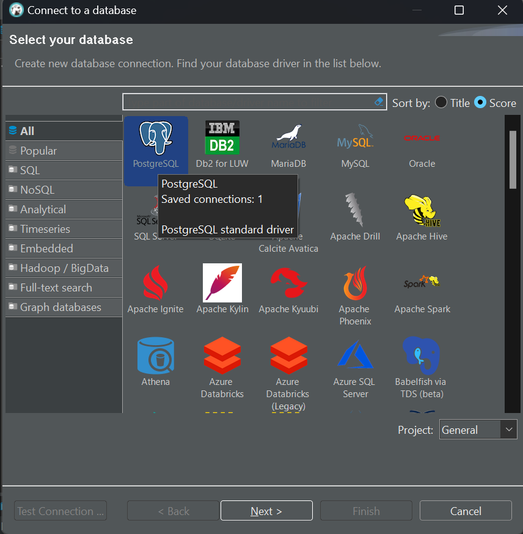
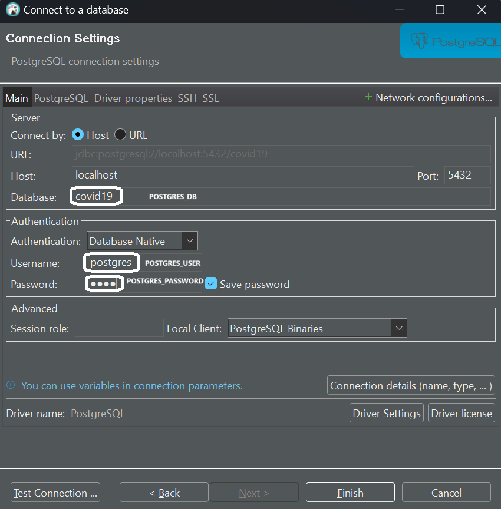
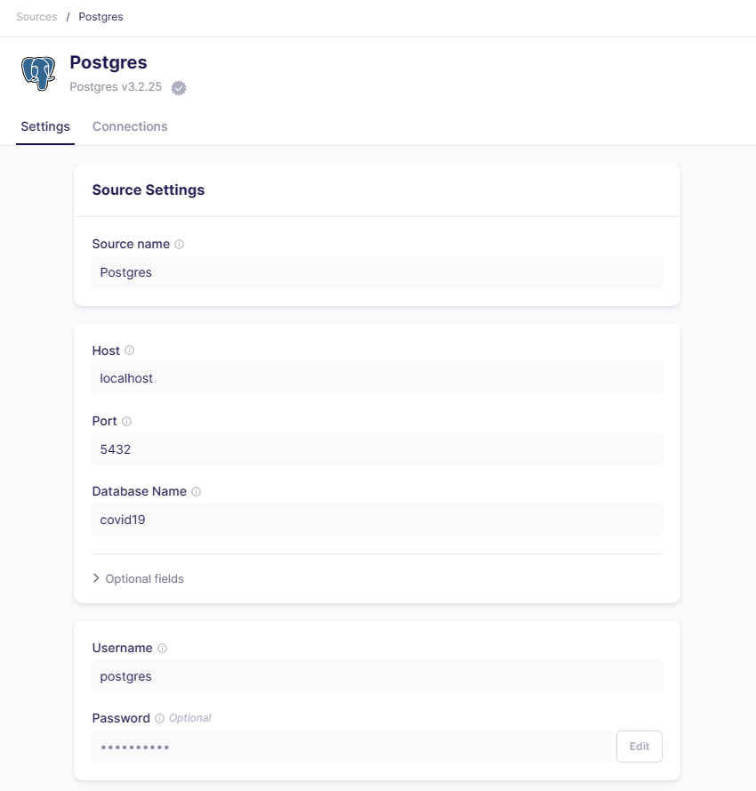
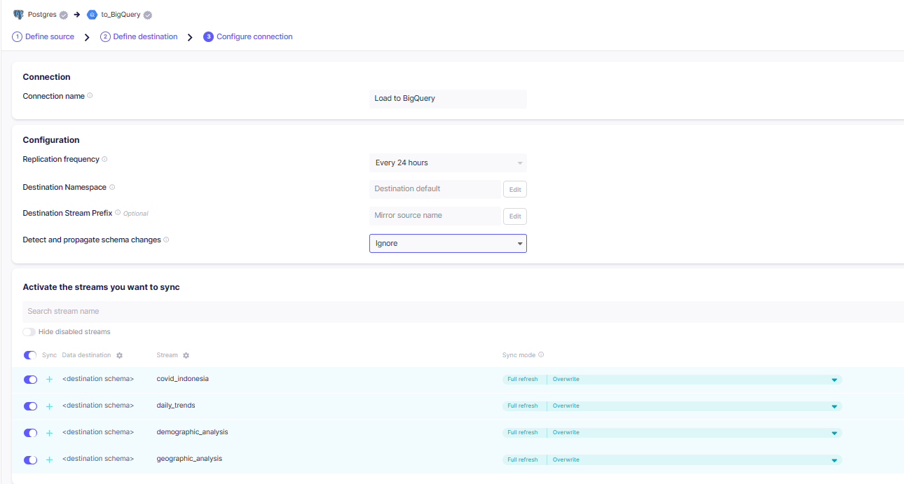
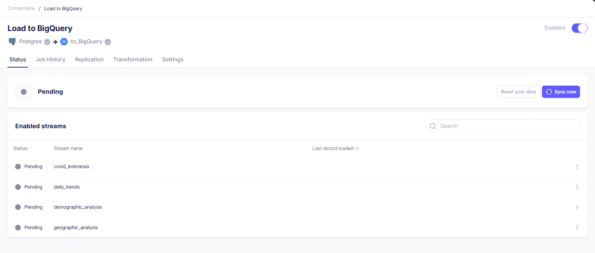
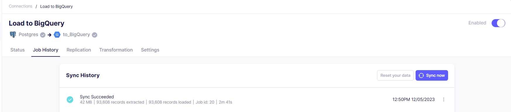
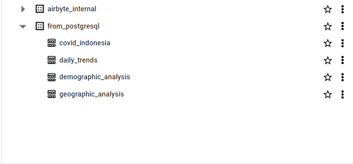

# Goals
#### This project represents my journey in the realm of Data Engineering. The project creates a simple Data Pipeline. First, I need to inspect the dataset using Google Colab to perform data wrangling. Then, I ingest data to PostgreSQL and use dbt core to implement data modeling. Finally, I load them to Google BigQuery using Airbyte.

## Prerequisites

Prerequisites: 
  1. Google Colab or Jupyter Notebook account
  2. Python & Virtual Environment setup
  3. DBT setup & run
  4. PostgreSQL & Airbyte setup & run with Docker-compose
  5. PostgreSQL management with DBeaver
  6. Airbyte setup to ingest data from PostgreSQL to BigQuery
  7. Google Cloud Platform account connected to BigQuery

### Python & Virtual Environment

- Check global installed python version 

```bash
    python --version
```

- Install virtualenv

```bash
    pip install virtualenv
```

- Install python3.10.11 virtual environment locally

```bash
    virtualenv -p python3.10.11 venv
```
- Activate virtual environment and check python version

Windows
```bash
    source venv/Scripts/activate 
    python --version
```
Mac / Linux
```bash
    source venv/bin/activate 
    python --version
```

## Run PostgreSQL & Airbyte service with docker-compose

To run Postgres with docker-compose we will create a [docker-compose.yml](/docker/docker-compose.yml).

To start the containers, run this command: 

```bash
    cd airbyte
```

```bash
    docker-compose -f docker-compose.yml up -d 
```

## Manage postgresql with DBeaver

- Open DBeaver, then create `New Database Connection`
- Choose postgresql 
- Fill in the connection attributes as our settings on postgresql docker 
```bash
  # Postgresql credential

    - Host: localhost:5432
    - Username: postgres
    - Password: pass
    - DB: covid19
```
## Ingestion Data to PostgreSQL
- In this step, I perform Data Wrangling. You can check the code [here](data_wrangling.ipynb). I use Google Colab for this task.
- We have a large number of libraries need to be installed, we can install all the packages at once by using the [requirements.txt](/requirements.txt) file. The syntax would be:

```bash
    pip install -r requirements.txt
```

- Download the dataset that has previously undergone the Data Wrangling process from Google Colab. Then, ingest this dataset into PostgreSQL using this [code](/load_to_postgres.py)


## Install DBT-Postgres

```bash
pip install dbt-postgres # Note: DBT has many DBMS adapter
```

## Create requirements.txt

In order to keep track what packages you have installed, it is better to make an up-to-date list of `requirements.txt`.

You can list your dbt-related packages by invoking


```bash
pip freeze | grep dbt
```

The output will be similar to:

```
dbt-core==1.6.3
dbt-extractor==0.4.1
dbt-postgres==1.6.3
dbt-semantic-interfaces==0.2.0
```

Put the list into `requirements.txt` by doing this:

```bash
pip freeze | grep dbt >> requirements.txt
```

If you need to install other packages, you should add them into `requirements.txt` as well

Next time you want to install `dbt` and other libraries, you can simply run `pip install -r requirements.txt`


## Setup DBT Profile

By default, DBT will create a dbt profile at your home directory `~/.dbt/profiles.yml`

You can update the profiles, or you can make a new dbt-profile directory.

To make a new dbt-profie directory, you can invoke the following:

```bash
mkdir dbt-profiles
touch dbt-profiles/profiles.yml
export DBT_PROFILES_DIR=$(pwd)/dbt-profiles
```

You can set your `profiles.yml` as follow:

```yml
my_project:
  outputs:

    dev:
      type: postgres
      threads: 1
      host: localhost
      port: 5432
      user: postgres
      pass: pass
      dbname: covid19
      schema: public

  target: dev

```

Always remember to set `DBT_PROFILES_DIR` everytime you want to work with DBT. Otherwise, you should add `--profiles-dir` option everytime you run DBT. 

Please refer to [DBT profile documentation](https://docs.getdbt.com/docs/core/connect-data-platform/connection-profiles) for more information.  

## Setup DBT Project configuration

To setup DBT project configuration, you can edit `my_project/dbt_project.yml`.

Make sure your `models` looks like this:

```yml
models:
  my_project:
    # Config indicated by + and applies to all files under models/example/
    covid19:
      +schema: public
      +database: covid19
    covid19_analytics:
      +materialized: table
      +schema: analytics
      +database: covid19
```

The configuration tells you that:

- You have two folders under `models` directory:
  - `store`
  - `covid19_analytics`
- Every model in your `store` directory by default is corresponding to `covid19.public` schema.
- Every model in your `covid19_analytics` directory by default is
  - Corresponding to `covid19.analytics` schema
  - Materialized into `table`

Notice that every key started with `+` are configurations.

## Defining Source

To define source, you can put the following YAML into `models/covid19/schema.yml`

```yaml
version: 2

sources:
  - name: covid19
    database: covid19
    schema: public

    tables:
      - name: covid_indonesia
        columns:
          - name: date
            description: "Date of the record"
            tests:
              - not_null
          - name: location_iso_code
            description: "ISO code of the location"
            tests:
              - not_null
          - name: location
            description: "Name of the location"
            tests:
              - not_null
          - name: new_cases
            description: "Number of new cases"
            tests:
              - not_null
          - name: new_deaths
            description: "Number of new deaths"
            tests:
              - not_null
          - name: new_recovered
            description: "Number of new recoveries"
            tests:
              - not_null
          - name: new_active_cases
            description: "Number of new active cases"
            tests:
              - not_null
          - name: total_cases
            description: "Total number of cases"
            tests:
              - not_null
          - name: total_deaths
            description: "Total number of deaths"
            tests:
              - not_null
          - name: total_recovered
            description: "Total number of recoveries"
            tests:
              - not_null
          - name: total_active_cases
            description: "Total number of active cases"
            tests:
              - not_null
          - name: location_level
            description: "Level of the location"
            tests:
              - not_null
          - name: province
            description: "Province of the location"
            tests:
              - not_null
          - name: country
            description: "Country of the location"
            tests:
              - not_null
          - name: continent
            description: "Continent of the location"
            tests:
              - not_null
          - name: island
            description: "Island of the location"
            tests:
              - not_null
          - name: time_zone
            description: "Time zone of the location"
            tests:
              - not_null
          - name: total_regencies
            description: "Total number of regencies in the location"
            tests:
              - not_null
          - name: total_cities
            description: "Total number of cities in the location"
            tests:
              - not_null
          - name: total_districts
            description: "Total number of districts in the location"
            tests:
              - not_null
          - name: total_urban_villages
            description: "Total number of urban villages in the location"
            tests:
              - not_null
          - name: total_rural_villages
            description: "Total number of rural villages in the location"
            tests:
              - not_null
          - name: area_km2
            description: "Area of the location in square kilometers"
            tests:
              - not_null
          - name: population
            description: "Population of the location"
            tests:
              - not_null
          - name: population_density
            description: "Population density of the location"
            tests:
              - not_null
          - name: longitude
            description: "Longitude of the location"
            tests:
              - not_null
          - name: latitude
            description: "Latitude of the location"
            tests:
              - not_null
          - name: new_cases_per_million
            description: "Number of new cases per million people"
            tests:
              - not_null
          - name: total_cases_per_million
            description: "Total number of cases per million people"
            tests:
              - not_null
          - name: new_deaths_per_million
            description: "Number of new deaths per million people"
            tests:
              - not_null
          - name: total_deaths_per_million
            description: "Total number of deaths per million people"
            tests:
              - not_null
          - name: total_deaths_per_100rb
            description: "Total number of deaths per 100,000 people"
            tests:
              - not_null
          - name: case_fatality_rate
            description: "Case fatality rate"
            tests:
              - not_null
          - name: case_recovered_rate
            description: "Case recovery rate"
            tests:
              - not_null
          - name: growth_factor_of_new_cases
            description: "Growth factor of new cases"
            tests:
              - not_null
          - name: growth_factor_of_new_deaths
            description: "Growth factor of new deaths"
            tests:
              - not_null
```
This define your existing tables, as well as some tests to ensure data quality

Notice that you can use `source('<source-name>', '<table>')` to refer to any table in your source.

## Creating a Model

Now you can define a new model under `models/covid19_analytics` folder.

First, you need to define the `schema.yml`:
```yaml
version: 2

models:
  - name: daily_trends
    description: Model that shows the daily trend of new cases, new deaths, and new recoveries
    columns:
      - name: date
        description: Date of the record
        tests:
          - not_null
      - name: daily_new_cases
        description: Number of new cases on the date
        tests:
          - not_null
      - name: daily_new_deaths
        description: Number of new deaths on the date
        tests:
          - not_null
      - name: daily_new_recoveries
        description: Number of new recoveries on the date
        tests:
          - not_null
      - name: previous_day_new_cases
        description: Number of new cases on the previous day
      - name: previous_day_new_deaths
        description: Number of new deaths on the previous day
      - name: previous_day_new_recoveries
        description: Number of new recoveries on the previous day


  - name: demographic_analysis
    description: Model that shows the impact of population density on the spread of COVID-19
    columns:
      - name: date
        description: Date of the record
        tests:
          - not_null
      - name: location
        description: Name of the location
        tests:
          - not_null
      - name: population
        description: Population of the location
        tests:
          - not_null
      - name: population_density
        description: Population density of the location
        tests:
          - not_null
      - name: total_cases
        description: Total number of cases on the date
        tests:
          - not_null
      - name: total_deaths
        description: Total number of deaths on the date
        tests:
          - not_null
      - name: total_recoveries
        description: Total number of recoveries on the date
        tests:
          - not_null
      - name: cases_per_million
        description: Number of cases per million people on the date
        tests:
          - not_null
      - name: deaths_per_million
        description: Number of deaths per million people on the date
        tests:
          - not_null
      - name: recoveries_per_million
        description: Number of recoveries per million people on the date
        tests:
          - not_null
      
  - name: geographic_analysis
    description: Model that shows the spread of COVID-19 across different locations and regions
    columns:
      - name: date
        description: Date of the record
        tests:
          - not_null
      - name: location
        description: Name of the location
        tests:
          - not_null
      - name: province
        description: Province of the location
        tests:
          - not_null
      - name: country
        description: Country of the location
        tests:
          - not_null
      - name: continent
        description: Continent of the location
        tests:
          - not_null
      - name: island
        description: Island of the location
        tests:
          - not_null
      - name: total_cases
        description: Total number of cases on the date
        tests:
          - not_null
      - name: total_deaths
        description: Total number of deaths on the date
        tests:
          - not_null
      - name: total_recoveries
        description: Total number of recoveries on the date
        tests:
          - not_null
```
You can define as much as models as you need, but in this example, we only create 3 models:
- `daily_trends` to show `A model displaying the daily trend of new cases, deaths, and recoveries` check [code](/my_project/models/covid19_analytics/daily_trends.sql)
- `demographic_analysis` to show `a model displaying the impact of population density on the spread of COVID-19` check [code](/my_project/models/covid19_analytics/demographic_analysis.sql)
- `geographic_analysis` to show `a model displaying the spread of COVID-19 across different locations and regions` check [code](/my_project/models/covid19_analytics/geographic_analysis.sql)

## Run and test your model

Once you create a model, you can then run your model

```bash
cd my_project
dbt run
dbt test
```
To see what kind of test you can pefrom, you can visit dbt_utils documentation: https://github.com/dbt-labs/dbt-utils

## Setup Connection in Airbyte

- Open the Airbyte dashboard on [http://localhost:8000/](http://localhost:8000/) in browser, login with 
```bash
    - Username: airbyte
    - Password: password
```

- Then, create connection

    

## Ingest from Postgresql to Google BigQuery
We will ingest data from PostgreSQL, which has already undergone data wrangling and data modeling using dbt, into Google BigQuery.

- Define Source
    
  Fill in the sources attributes 
  ```bash
      - Host: localhost
      - Port: 5432
      - Username: postgres
      - Password: pass
      - DB: covid19
  ```
- Define Destinations

  Fill in the destinations attributes 
  

  Configure connections
  

- Start synchronizing data
  

- Synchronizing status success
  
- Data has been successfully loaded into BigQuery
  

